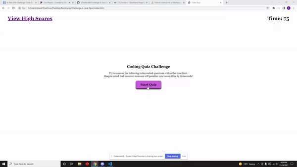

# Code Quiz
This is Challenge 4 of the Bootcamp. A Coding quiz with multiple-choice questions. Written and designed 100% by myself.

## Installation
1. Download or clone the Repository
2. Open the main page (index.html) on your browser to view webpage
3. Use of Visual Studio is recommended to view all coding.

## Instructions
1. Click "Start Quiz" button. A multiple choice test will begin
  * Timer is on top right corner of page. Total time is 75 seconds. There are 4 questions total.
  * Incorrect answers with deduct 10 seconds from the timer. Once all questions are answered, or the timer reaches zero, the game is over.
  * The timer is your score.
  * To View High Scores, click the link in the top left corner of page. This will show all current high scores.
  * Incorrect answeres will show a "Wrong!" statement at bottom of questions.
  * correct answers will show a "Correct!" statement at bottom of questions.

2. When game is over, the must enter their initials and click "Submit" to save high score.

3. Next the high score page will show up with all saved scores.

4. You can click either the "Go Back" button to go back to start screen, or the "Clear High Scores" button to clear all current scores and start fresh.

## Coding Used
* HTML
* CSS
* Javascript

## Demo

## Websites
* Deployed Application: https://dsiedlarz90.github.io/Challenge-4-Java-Quiz/
* Github Repository: https://github.com/DSiedlarz90/Challenge-4-Java-Quiz
